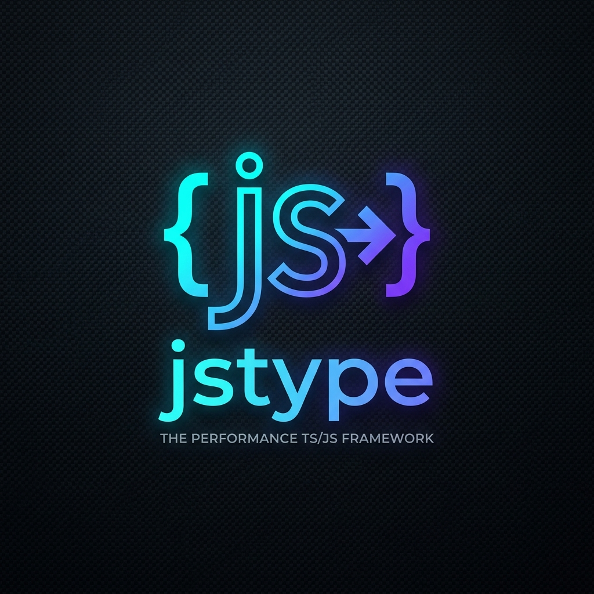

<p align="center">
  
</p>

<h1 align="center">jstype</h1>

<p align="center">
  <b>Ultra-Fast, Universal Web Standards Framework with Zero-Overhead End-to-End Type Safety</b>
</p>

<p align="center">
  <a href="#features">Features</a> •
  <a href="#quickstart">Quickstart</a> •
  <a href="#modular-sub-routing">Sub-Routing</a> •
  <a href="#realtime-streaming--sse">Streaming & SSE</a> •
  <a href="#production-middlewares">Security Middlewares</a> •
  <a href="#runtime-adapters">Runtimes & Node.js</a> •
  <a href="#monorepo-structure">Monorepo</a> •
  <a href="#license">License</a>
</p>

---

## ⚡ Overview

**jstype** adalah modern web framework berbasis JavaScript & TypeScript yang dibangun di atas standar Fetch API Web murni (`Request`, `Response`, `Headers`). 

Framework ini dirancang untuk kompatibilitas universal lintas runtime modern (**Node.js 20+**, **Bun**, **Deno**, dan **Cloudflare Workers**) dengan performa tinggi berkat router berbasis **Radix Trie** serta **Zero-overhead Typed RPC Client** (`@jstype/client`) yang langsung menginferensikan tipe rute backend di frontend tanpa perlu proses codegen manual.

---

## ✨ Features

- 🌐 **Universal Web Standards**: Beroperasi di mana saja Fetch API tersedia — Node.js, Bun, Deno, Edge runtimes.
- 🚀 **Ultra-Fast Radix Router**: Pencocokan rute $O(k)$ berkecepatan tinggi dengan parameter dinamis (`:param`) dan wildcards (`*`).
- 🔀 **Modular Sub-Routing (`app.route`)**: Komposisi arsitektur micro-services dan modular routers dengan pewarisan middleware dan inferensi tipe path otomatis.
- 📡 **Realtime Streaming & Server-Sent Events (SSE)**: Built-in helper `c.streamText()` dan `c.streamSSE()` untuk streaming respon model AI (LLM) dan event feed waktu-nyata.
- 🔒 **End-to-End Type Safety**: Autocomplete rute, HTTP methods, route params, query string, dan payload JSON secara otomatis di sisi client.
- 🛡️ **Schema Validation Adapter**: Validasi runtime first-class dengan dukungan Standard Schema v1 (`~standard`), Zod, TypeBox, dan Valibot via `validator('json' | 'query' | 'param' | 'header', schema)`.
- 📖 **OpenAPI 3.1 & Interactive Docs**: Auto-generate spesifikasi OpenAPI 3.1 dan dokumentasi interaktif dengan UI modern (**Scalar** & **Swagger UI**) via `app.doc()`, `scalarDocs()`, dan `describeRoute()`.
- 🛡️ **Built-in Security & Hardening Middlewares**: 
  - `secureHeaders()` (CSP, HSTS, X-Frame-Options, X-Content-Type-Options)
  - `etag()` (auto ETag computation & `304 Not Modified`)
  - `rateLimiter()` (sliding window rate limiting dengan header `RateLimit-*`)
  - `bearerAuth()` & `basicAuth()` (autentikasi API terverifikasi)
  - `cors()` & `logger()`
- 🖥️ **Official Node.js Adapter (`@jstype/node`)**: Adapter resmi `serve(app, { port })`, `getRequestListener()`, dan `serveStatic()` untuk eksekusi native di Node.js.
- 📦 **Zero-Overhead Typed RPC Client (`@jstype/client`)**: Proxy-based client tanpa build/codegen step terpisah. Cukup ekspor `type AppType = typeof app`.
- 🛡️ **Zero Heavy Dependencies**: Sangat ringan dan mengandalkan native web primitives.

---

## 🚀 Quickstart

### 1. Definisi Server (`server.ts`)

```ts
import { JSType, cors, secureHeaders, etag, logger, validator, describeRoute } from '@jstype/core';
import { z } from 'zod';

const app = new JSType();

// Built-in Middlewares
app.use(secureHeaders());
app.use(cors());
app.use(etag());
app.use(logger());

// OpenAPI 3.1 & Interactive Scalar Docs
app.doc('/openapi.json', { title: 'My API', version: '1.0.0' });
app.scalarDocs('/docs', { specUrl: '/openapi.json', title: 'Interactive Docs' });

// Zod Schema
const createUserSchema = z.object({
  name: z.string().min(2),
  role: z.enum(['admin', 'user']),
});

// Modular Sub-Router
const users = new JSType()
  .get(
    '/',
    describeRoute({ summary: 'List all users', tags: ['Users'] }),
    (c) => c.json([{ id: '1', name: 'Alice', role: 'admin' }])
  )
  .post(
    '/',
    describeRoute({ summary: 'Create user', tags: ['Users'] }),
    validator('json', createUserSchema),
    (c) => {
      const user = c.req.valid('json'); // 100% Type-Safe derived from Zod!
      return c.json({ id: '2', ...user }, 201);
    }
  );

// Mount Sub-Router
const routes = app
  .get('/health', (c) => c.text('OK'))
  .route('/api/users', users);

export type AppType = typeof routes;
export default app;
```

### 2. Menjalankan di Node.js (`@jstype/node`)

```ts
import { serve } from '@jstype/node';
import app from './server.js';

serve(app, { port: 3000 }, (info) => {
  console.log(`Server running at http://localhost:${info.port}`);
});
```

*Atau langsung jalankan di Bun tanpa adapter:*
```bash
bun run server.ts
```

### 3. Konsumsi di Client Frontend (`client.ts`)

```ts
import { createClient } from '@jstype/client';
import type { AppType } from './server.js';

const client = createClient<AppType>('http://localhost:3000');

// 1. GET /api/users -> Autocompletion penuh & return type terinferensi!
const usersRes = await client.api.users.$get();
const users = await usersRes.json(); 

// 2. POST /api/users -> Type check body JSON
const createRes = await client.api.users.$post({
  json: { name: 'Charlie', role: 'admin' },
});
```

---

## 🔀 Modular Sub-Routing (`app.route`)

Organisasikan backend ke dalam modul-modul terpisah:

```ts
import { JSType } from '@jstype/core';

const posts = new JSType()
  .get('/', (c) => c.json([{ id: 1, title: 'Hello World' }]))
  .get('/:id', (c) => c.json({ id: c.req.param('id') }));

const comments = new JSType()
  .get('/', (c) => c.json([{ id: 1, comment: 'Nice!' }]));

// Sub-routing bersarang (nested)
posts.route('/:postId/comments', comments);

const app = new JSType()
  .route('/api/posts', posts);

// Menghasilkan rute:
// GET /api/posts
// GET /api/posts/:id
// GET /api/posts/:postId/comments
```

---

## 📡 Realtime Streaming & SSE

Gunakan `c.streamSSE()` untuk streaming event waktu-nyata atau token respon AI:

```ts
app.get('/api/chat', (c) => {
  return c.streamSSE(async (stream) => {
    await stream.writeSSE({
      event: 'message',
      data: { text: 'Thinking...' },
      id: 1,
    });

    await stream.sleep(100);

    await stream.writeSSE({
      event: 'message',
      data: { text: 'Here is your answer!' },
      id: 2,
    });
  });
});
```

Dan untuk plain text chunked stream:
```ts
app.get('/stream', (c) => {
  return c.streamText(async (stream) => {
    await stream.write('Chunk 1\n');
    await stream.sleep(50);
    await stream.writeln('Chunk 2');
  });
});
```

---

## 🛡️ Production Middlewares

| Middleware | Deskripsi |
|---|---|
| `secureHeaders(options?)` | Menerapkan security headers standar industri (CSP, HSTS, X-Frame-Options, X-Content-Type-Options, Referrer-Policy). |
| `etag(options?)` | Menghitung hash ETag secara otomatis dan mengembalikan `304 Not Modified` jika `If-None-Match` cocok. |
| `rateLimiter(options?)` | Membatasi laju request per klien dan menyertakan header standar `RateLimit-Limit`, `RateLimit-Remaining`, `RateLimit-Reset`. |
| `bearerAuth(options)` | Memvalidasi HTTP Bearer Authorization header dengan token statis atau fungsi verifikasi asinkron. |
| `basicAuth(options)` | Memvalidasi HTTP Basic Authorization credentials dengan base64 decoding. |
| `cors(options?)` | Cross-Origin Resource Sharing dengan preflight OPTIONS dan origin matching dinamis. |
| `logger(options?)` | Mencatat HTTP method, URL path, status respon, dan durasi latensi eksekusi. |

---

## 🖥️ Runtime Adapters

### Node.js (`@jstype/node`)
```ts
import { serve, serveStatic } from '@jstype/node';
import { JSType } from '@jstype/core';

const app = new JSType();

// Sajikan file statis dari folder public
app.use(serveStatic({ root: './public' }));

serve(app, { port: 8080 }, ({ port }) => {
  console.log(`Listening on http://localhost:${port}`);
});
```

### Bun
```ts
export default app;
```

### Cloudflare Workers
```ts
export default {
  fetch: app.fetch,
};
```

---

## 📁 Struktur Monorepo

```
jstype/
├── packages/
│   ├── core/           # @jstype/core: Router, Context, Middleware, App Engine, Streaming
│   ├── client/         # @jstype/client: Proxy-based Typed RPC Client
│   └── node/           # @jstype/node: Node.js HTTP Server Adapter & Static Files
├── examples/
│   └── basic-api/      # Real-world Demo: Typed API + Modular Routes + Client
├── assets/
│   └── jstype_logo.jpg # Brand logo jstype
├── .github/
│   └── workflows/
│       └── ci.yml      # Multi-OS & Multi-Node CI pipeline
├── PRD.md              # Product Requirements Document
├── BLUEPRINT.md        # Technical Architecture Blueprint
├── ROADMAP.md          # Execution Roadmap
└── package.json        # pnpm workspaces root
```

---

## 🛠️ Perintah Workspace

```bash
# Install seluruh dependensi workspace
pnpm install

# Jalankan seluruh test suite (73 tests passed)
pnpm test

# Verifikasi type check TypeScript
pnpm typecheck

# Build semua package (ESM, CJS, .d.ts)
pnpm build

# Menjalankan demo interaktif basic-api
pnpm --filter example-basic-api start
```

---

## ⚖️ License

MIT License © 2026 Roedy Rustam & Kontributor jstype.
